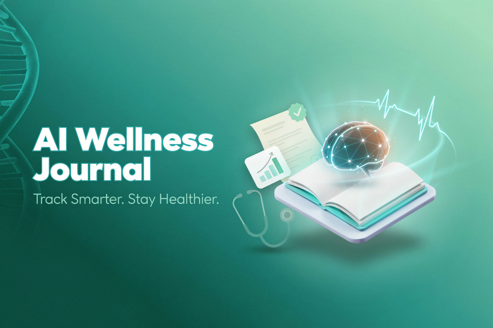

<div align="center">



# 🩺 AI Wellness Journal

**Track symptoms, get AI-powered insights, and walk into doctor appointments prepared**

[](https://nextjs.org)
[](https://www.typescriptlang.org)
[](https://supabase.com)
[](https://ai.google.dev)
[](https://tailwindcss.com)

</div>

<br/>

AI Wellness Journal lets you log daily symptoms with severity ratings and personal notes, then surfaces AI-powered health summaries and pattern analysis over time. It generates structured doctor-ready reports so you arrive at every appointment with clear, organized context — shifting healthcare from reactive to preventive.

## ✨ Features

- **Symptom Logging** — Record daily symptoms, severity levels, and freeform notes in seconds
- **Health Timeline** — Visualize patterns and trends across your symptom history
- **AI-Powered Insights** — Google Gemini analyzes your logs and generates personalized health summaries
- **Doctor Report Generation** — Produce structured, shareable reports that make appointments more productive
- **Quick Stats Dashboard** — At-a-glance view of your recent health activity and recurring patterns
- **Responsive UI** — Clean, accessible interface built for both desktop and mobile

## 🎥 Demo

[](https://www.youtube.com/watch?v=myZLzRm9C4Q)

## 🛠️ Tech Stack

| Layer | Technology |
|-------|-----------|
| Framework | Next.js (App Router) |
| Language | TypeScript |
| Database & Auth | Supabase |
| AI | Google Gemini API |
| Styling | Tailwind CSS + Lucide Icons |

## 🚀 Getting Started

**Prerequisites:** Node.js v18+, a Supabase project, and a Google Gemini API key.

```bash
git clone https://github.com/kyisaiah47/ai-wellness-journal.git
cd ai-wellness-journal
npm install
cp .env.local.example .env.local   # fill in your Supabase + Gemini keys
npm run dev
```

Open [http://localhost:3000](http://localhost:3000) to view the app.

### Environment Variables

```
NEXT_PUBLIC_SUPABASE_URL=
NEXT_PUBLIC_SUPABASE_ANON_KEY=
NEXT_PUBLIC_GOOGLE_API_KEY=
```

> **Disclaimer:** AI insights are for informational purposes only and do not replace professional medical advice.

## 📄 License

MIT
